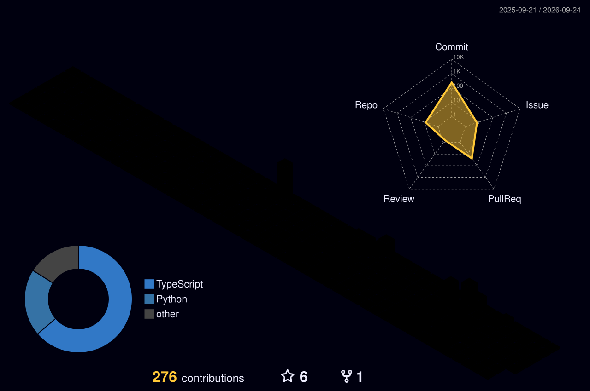

  

<!--
 https://readme-typing-svg.demolab.com/demo
-->

  

  

---

## 👋 Hey!

- 🎓 Computer Engineering student & Full Stack Backend Developer.
- 💻 Currently building my personal portfolio and developing scalable backends
- 🎮 Passionate about diving deep into the game development world.
- 📫 How to reach me: Serdarsahinn05@gmail.com or via the links below 👇

<!--
  SOSYAL MEDYA / İLETİŞİM ROZETLERİ — shields.io
-->
---
## 🔗 Bağlantılar

  
  
  
  

<!--
  TEKNOLOJİLER — skillicons.dev
  i= parametresine virgülle ayırarak istediğin teknolojiyi ekle/çıkar.
  Tüm liste: https://skillicons.dev
-->
---
## 🛠️ Tech Stack

  

---

### 🕹️ Pixel Art Stat Card

  

---

  

  

---

  

---
## 🏆 GitHub Trophies

  

---
<!--
  METRICS (lowlighter/metrics) — HEPSİ BİR ARADA ALTERNATİF
  47+ plugin ve 300'den fazla
  seçenek var (isometric commit calendar, achievements, languages, WakaTime, Steam, Anilist, hatta 3D "GitHub Skyline"
  En kolay kurulum — ücretsiz paylaşılan instance (metrics.lecoq.io), tek satır:
-->
### 📈 Metrics

  

<!--
  Not: metrics.lecoq.io küçük, ücretsiz bir sunucu üzerinde çalışıyor — görseller
  1 saat cache'leniyor ve yoğunlukta yavaş/kararsız olabilir. Hangi plugin'leri
  (isocalendar, achievements, wakatime, calendar, skyline...) göstermek
  istediğini seçmek için https://metrics.lecoq.io adresine gidip görsel bir
  arayüzden kendi URL'ini oluşturabilirsin — sonra o URL'i buraya yapıştırırsın.
  Tüm özellikleri (bazı plugin'ler shared instance'ta kapalı) kullanmak istersen
  kendi GitHub Actions workflow'unu kurman gerekiyor, bkz:
  https://github.com/lowlighter/metrics#-setup
-->
---

### 🏙️ 3D Contribution Schedule

## 🐍 Contribution Snake

<picture>
  <source media="(prefers-color-scheme: dark)" srcset="https://raw.githubusercontent.com/Serdarsahinn05/Serdarsahinn05/main/dist/github-snake-dark.svg" />
  
</picture>

---

  

